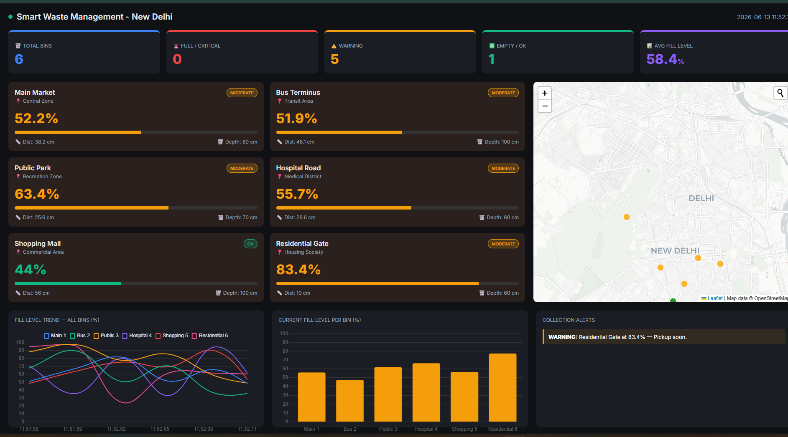
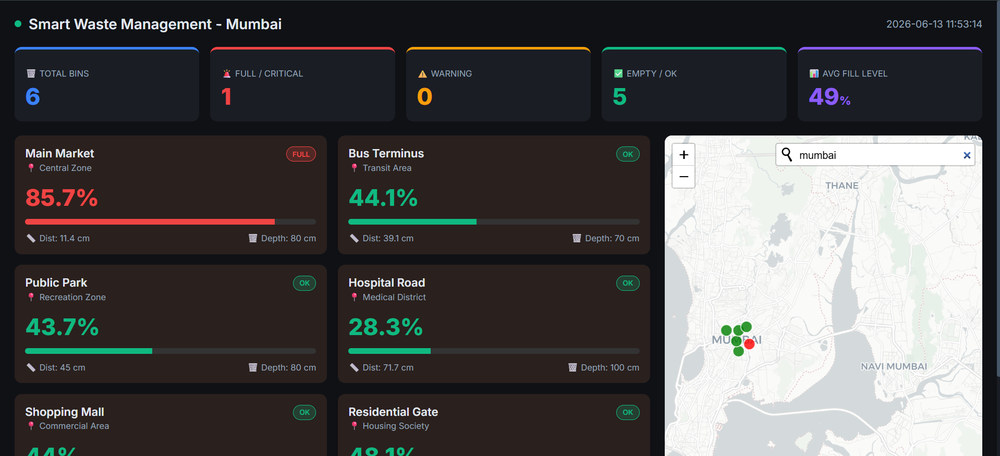

 ♻️ Smart Waste Management & Bin Level Detection System


An industry-oriented Internet of Things (IoT) project designed to optimize urban waste collection. The system monitors garbage bin fill levels in real-time, visualizing the data on a dynamic, premium web dashboard, and generates automated alerts for municipal authorities to prevent bin overflow.

## 📸 Dashboard Previews

### 🌍 Dynamic City Search & Live Monitoring (New Delhi)


### 📊 Real-time Analytics & Alerts (Mumbai)


*(Note: The system dynamically generates simulation data and bin locations based on the city searched in the interactive map).*

---

## 🚀 Key Features

* **Dynamic Map Integration:** Built-in Leaflet geocoder allows searching for any city globally. The system automatically places simulated bins around the searched coordinates.
* **Real-time Analytics:** Live updates of fill percentages using Chart.js (Line trends and Bar charts).
* **Automated Alert System:** Triggers "CRITICAL" and "WARNING" alerts when bins exceed specific thresholds (>85% and >70%).
* **Hardware Ready:** Includes ESP32 C++ firmware for physical deployment using HC-SR04 ultrasonic sensors.
* **Premium UI/UX:** Responsive, dark-themed Glassmorphism UI built with modern HTML5 and CSS3.

---

## 🛠️ Technology Stack

* **Backend:** Python, Flask
* **Frontend:** HTML5, CSS3, JavaScript, Chart.js, Leaflet.js
* **Hardware (IoT):** ESP32 Microcontroller, HC-SR04 Ultrasonic Sensor
* **Simulation:** Python Random Data Generator & REST APIs

---

## 📂 Project Structure

```text
📦 Smart-Waste-Management-IoT
 ┣ 📂 arduino_code         # ESP32 C++ firmware (esp32_smart_bin.ino)
 ┣ 📂 circuit_diagram      # Hardware wiring guide (wiring.txt)
 ┣ 📂 data                 # Data logs directory (bin_log.csv)
 ┣ 📂 docs                 # Additional documentation
 ┣ 📂 images               # Screenshots for README
 ┣ 📂 python_simulation    # Standalone simulation scripts
 ┣ 📂 templates            # Frontend HTML files (index.html)
 ┣ 📜 app.py               # Main Flask Application backend
 ┣ 📜 requirements.txt     # Python dependencies
 ┣ 📜 .gitignore           # Git ignore rules
 ┗ 📜 README.md            # Project documentation
⚙️ Installation & Setup (Virtual Simulation)Follow these steps to run the dashboard on your local machine:1. Clone the repository:Bashgit clone https://github.com/dalimkumar452-sudo/Smart-Waste-Management-IoT.git 

cd Smart-Waste-Management-IoT
2. Create and activate a Virtual Environment:Bashpython -m venv .venv
# On Windows:
.venv\Scripts\activate
# On MacOS/Linux:
source .venv/bin/activate
3. Install required dependencies:Bashpip install -r requirements.txt
# Or simply install Flask directly:
pip install flask
4. Run the application:Bashpython app.py
5. Open your browser: Navigate to http://127.0.0.1:5000🔌 Hardware Implementation (ESP32)If you are building the physical prototype, wire the components as follows:ESP32 PinComponent PinFunctionVIN / 5VVCCPower for HC-SR04GNDGNDGroundGPIO 5TRIGTrigger pin for Ultrasonic SensorGPIO 18ECHOEcho pin for Ultrasonic SensorUpload the esp32_smart_bin.ino file found in the arduino_code folder using the Arduino IDE.🔮 Future ScopeIntegration of Machine Learning (ML) for predictive route optimization for garbage trucks.Adding MQ-135 Gas Sensors to monitor odor and harmful gas emissions from bins.Deploying the Flask backend to a cloud platform (e.g., Render, Heroku) with an actual MQTT broker.

Developed with  DALIM KUMAR ❤️ as an IoT Proof-of-Work Project.